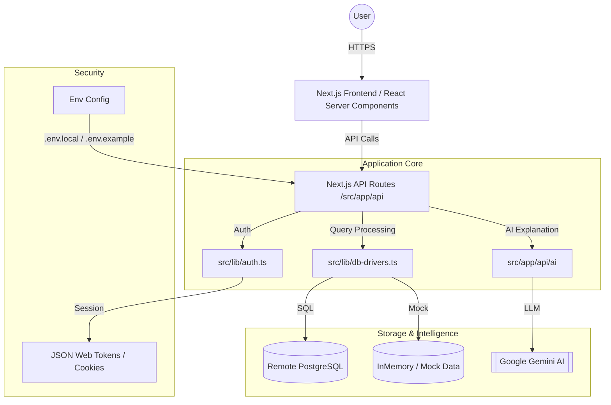

# High-Level Architecture - Orchids DB Web Editor

This document outlines the architectural patterns, tech stack, and system design for the Orchids DB Web Editor, intended for the Software Architects team.

## System Overview
Orchids DB Web Editor is a hybrid, cloud-native database management tool designed to provide an IDE-like experience in the browser. It supports both persistent remote connections (PostgreSQL) and a transient "No-Setup Demo Mode" (InMemory).

## 1. Core Tech Stack
- **Framework**: Next.js 15+ (App Router)
- **Runtime**: Bun / Node.js
- **Language**: TypeScript
- **Styling**: Tailwind CSS + Shadcn/UI
- **Animations**: Framer Motion
- **Editor**: Monaco Editor (planned/integrated via wrapper)
- **AI**: Gemini 2.5 Flash (Google AI SDK)
- **Database Connectivity**: Driver-based abstraction layer

## 2. High-Level Architecture Diagram

## 3. Key Architectural Patterns

### 3.1. Hybrid Database Driver Layer (`src/lib/db-drivers.ts`)
The system uses a strategy pattern to handle multiple database types. The `db-drivers` module provides a unified interface for:
- Connecting to remote PostgreSQL instances.
- Falling back to an "In-Memory" demo mode when credentials are not provided.
- Standardizing result formats (rows, columns, metadata) across different engines.

### 3.2. AI-Assisted SQL Workflow
The AI layer is integrated as a middleware for query analysis.
- **Explain Mode**: Intercepts the current SQL query and sends it to Gemini 2.5 Flash to generate human-readable explanations.
- **Context Awareness**: Future phases include passing schema metadata to the AI for more accurate completions.

### 3.3. Security & Isolation
- **Credential Handling**: Database credentials are not stored in plain text. Remote connection strings are handled via secure environment variables or transient session headers.
- **Zero-Persistence Demo**: The demo mode ensures that users can explore the tool without risk of data leakage or infrastructure costs.

### 3.4. State Management
- **Server State**: Managed via Next.js Server Components and API Routes for data fetching.
- **Client State**: Minimal client state using standard React hooks, focusing on UI responsiveness (active tabs, query history).

## 4. Scalability & Deployment
- **Stateless API**: API routes are designed to be stateless, allowing horizontal scaling or deployment to Edge/Serverless environments.
- **Dockerized**: Containerized workflow with `Dockerfile` and `docker-compose.yml` for consistent development and production environments.

## 5. Future Architectural Considerations
- **Monaco Worker Support**: Offloading SQL parsing and linting to Web Workers for better UI performance.
- **Real-time Monitoring**: Integration with Supabase Realtime or WebSockets for live DB health metrics.
- **Plugin Architecture**: Enabling third-party drivers for MySQL, SQLite, and MongoDB.
